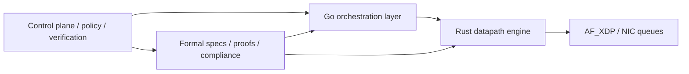

# Mohawk Network Stack Unification Plan

## Current workspace state

The original workspace contents have been cleared and the three requested source repositories have been cloned into separate folders:

- `Sovereign-Mohawk-Proto`
- `SMIP-MWP`
- `SMIP-MWP-Rust`

## Target outcome

Build one high-performance network stack with a clear split between control plane, dataplane, and verification:

- Rust owns the hot datapath and packet processing.
- Go owns orchestration, lifecycle, configuration, metrics, and integration glue.
- Sovereign-Mohawk-Proto contributes the protocol/verification/security model and higher-level federation logic.

## Repo roles

### Sovereign-Mohawk-Proto

Use this repo as the source of truth for protocol semantics, security assumptions, formal artifacts, and federated control-plane behavior.

Primary inputs to carry forward:

- transport and federation requirements
- formal verification artifacts and traceability
- security posture, identity, and compliance constraints
- higher-level control-plane behavior and observability expectations

### SMIP-MWP

Use this repo as the current production-oriented Go stack and integration reference.

Primary inputs to carry forward:

- Go control plane and service orchestration
- AF_XDP host integration and operational scripts
- benchmark harnesses, profiling, and tuning workflow
- current routing, metrics, and runtime plumbing

### SMIP-MWP-Rust

Use this repo as the performance core for the unified datapath.

Primary inputs to carry forward:

- AF_XDP packet I/O implementation
- routing and forwarding hot path
- crypto/session handling that has already been optimized for low allocation
- zero-copy packet representation and benchmark harness

## Recommended final architecture



The important design rule is to keep packet-rate work out of the Go/Rust boundary. The datapath should stay inside Rust, while Go sends coarse-grained configuration and session updates.

## Merge sequence

### Phase 1: Define the contract

1. Freeze the canonical packet format, session model, and routing semantics.
2. List every control-plane message, dataplane event, and metrics signal that must survive the merge.
3. Decide which behaviors are authoritative from the sovereign/proto repo versus which are implementation details from the two stack repos.
4. Write one shared interface spec for configuration, route updates, session setup, and health reporting.

### Phase 2: Carve the stack by responsibility

1. Move high-level policy, federation, and verification artifacts into a `spec/` or `docs/` layer.
2. Keep the Go repo as the integration and operations surface.
3. Keep the Rust repo as the datapath and crypto execution surface.
4. Avoid duplicating packet parsing, route selection, or crypto decisions across languages.

### Phase 3: Consolidate the datapath

1. Make the Rust implementation the single packet-processing engine.
2. Expose a stable boundary for route updates, key material, and counters.
3. Replace any per-packet cross-language calls with batched control messages.
4. Preserve zero-copy packet handling and allocation-free fast paths.

### Phase 4: Rebuild orchestration around the Rust core

1. Let Go own startup, config loading, cluster management, telemetry, and test harnesses.
2. Have Go deliver control-plane state to Rust in batches.
3. Keep AF_XDP tuning, host preparation, and benchmark automation in the Go/ops layer.
4. Ensure the runtime can still run in a degraded or stubbed mode for validation.

### Phase 5: Reattach verification and security

1. Map the sovereign protocol proofs to the unified packet and session model.
2. Add tests that prove the implementation matches the documented protocol contract.
3. Keep security-sensitive decisions traceable to a spec or proof artifact.
4. Add CI gates for formatting, unit tests, benchmarks, and any formal checks that remain feasible after the merge.

### Phase 6: Performance validation

1. Establish a single benchmark baseline before moving code.
2. Compare the unified stack against the current Go and Rust baselines separately.
3. Track packet throughput, tail latency, allocations, and AF_XDP queue behavior.
4. Fail the merge if a change increases per-packet allocation or adds avoidable language-boundary overhead.

## Concrete integration rules

- Do not let protocol proofs and performance code drift apart.
- Keep packet hot paths in Rust only.
- Keep orchestration and tooling in Go only.
- Use shared schema files or generated bindings for cross-language messages.
- Batch route, key, and policy updates.
- Prefer one canonical source for wire format and one canonical source for benchmark numbers.

## Suggested end-state repository layout

```text
stack/
  spec/            # sovereign protocol, security, and verification source of truth
  control/         # Go orchestration, APIs, tooling, and ops
  datapath/        # Rust AF_XDP engine and packet processing
  benchmarks/      # shared performance artifacts and runbooks
  docs/            # architecture, migration, and operator guides
```

## First implementation sprint

1. Produce an interface inventory from all three repos.
2. Identify duplicate packet, routing, and crypto code paths.
3. Select the canonical wire format and session state model.
4. Define the Rust-to-Go control boundary.
5. Build one end-to-end smoke path that launches the control plane and drives the Rust datapath.
6. Re-run the best existing benchmark from each repo and compare against the merged path.

## Acceptance criteria

The unification is only successful if the final stack can demonstrate all of the following:

- one authoritative protocol contract
- one datapath implementation
- one control-plane/orchestration layer
- preserved or improved throughput versus the current Rust path
- no regressions in verification or security traceability
- reproducible benchmarks and deployment instructions
